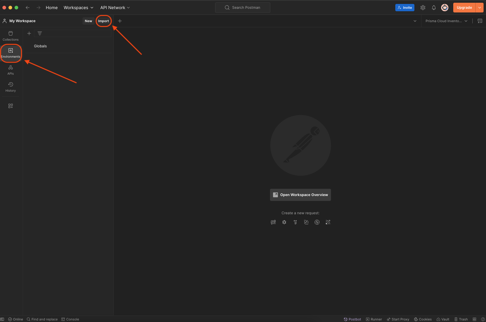
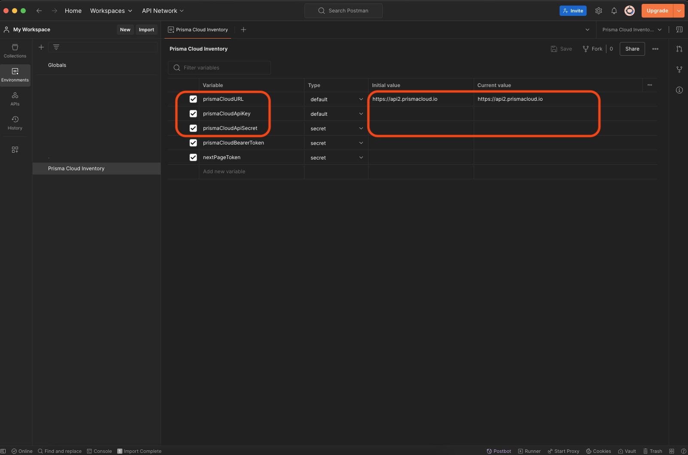
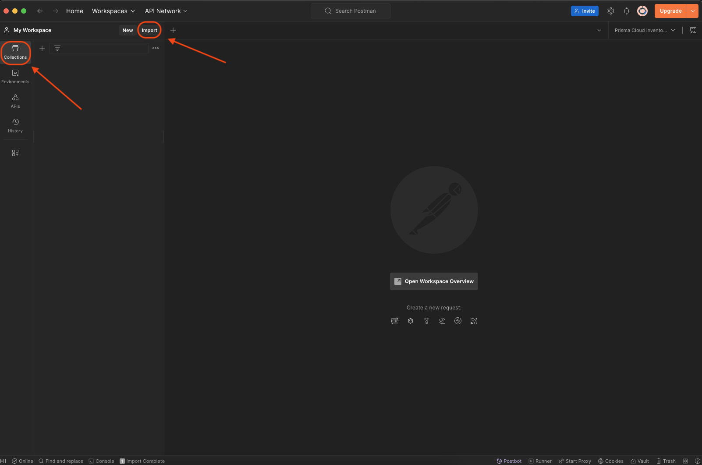
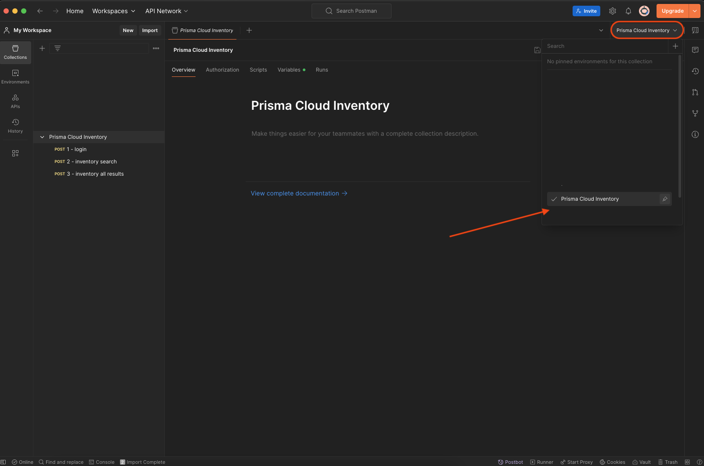

# Postman Collection and Environment

This repo contains examples for how to make API calls against Prisma Cloud Config queries to return JSON data from inventory.

- [Getting Started](#getting-started)
  - [Setup Environment](#setup-environment)
  - [Setup Collection](#setup-collection)
  - [Modify Query](#modify-query)
  - [Make a Request](#make-a-request)


## Getting Started

### Setup Environment

Open Postman, navigate to "Environments", select "Import", and follow the instuctions to upload a file. The file to upload is [Prisma Cloud Inventory.postman_environment.json](Prisma%20Cloud%20Inventory.postman_environment.json)



Once imported set the values for:  

  - prismaCloudURL 
  - prismaCloudApiKey
  - prismaCloudApiSecret
  



### Setup Collection

Open Postman, navigate to "Collections", select "Import", and follow the instuctions to upload a file. The file to upload is [Prisma Cloud Inventory.postman_collection.json](Prisma%20Cloud%20Inventory.postman_collection.json)



Once both the Environment and Collections have been created navigate to the `Prisma Cloud Inventory` collection, and select the `Prisma Cloud Inventory` environment that was created earlier. This scopes those variables to this collection.



### Modify Query

### Make a Request


## Offical API Documentation

- [Prisma Cloud APIs](https://pan.dev/prisma-cloud/api/)
- [Perform Config Search V2](https://pan.dev/prisma-cloud/api/cspm/search-config-v-2/)
- [Get The Next Config Search Page](https://pan.dev/prisma-cloud/api/cspm/search-config-page/)

## Postman Data

- [Collection](#collection)
  - [Collection Variables](#collection-variables)
  - [Collection APIs](#collection-apis)
    - [1 - login](#1---login)
    - [2 - inventory search ](#2---inventory-search)
    - [3 - inventory all results](#3---inventory-all-results)
- [Environment](#environment)
  - [Environment Variables](#environment-variables)
- [Query Examples](#query-examples)
  - [Return all S3 buckets in AWS Virginia (us-east-1) and AWS California (us-west-1)](#return-all-s3-buckets-in-aws-virginia-us-east-1-and-aws-california-us-west-1)
  - [Return all AWS ECR container images that have been deleted](#return-all-aws-ecr-container-images-that-have-been-deleted)
  - [Return all AWS EKS clusters](#return-all-aws-eks-clusters)
  - [Return all Azure CosmosDB databases](#return-all-azure-cosmosdb-databases)
  - [Return all Azure compute resources in East US 2 in resource groups matching the name MC_ (AKS managed node-group)](#return-all-azure-compute-resources-in-east-us-2-in-resource-groups-matching-the-name-mc_-aks-managed-node-group)

---

### Getting Started


### Collection

 | Name |  File  | 
 |------|--------|
 | Prisma Cloud Inventory | `Prisma Cloud Inventory.postman_collection.json`

---

#### Collection Variables

 | Name |  Type  | Assignment  | 
 |------|--------|-------------|
 | limit | `integer` | Static
 | withResourceJson | `boolean` | Static
 | startTime | `integer` | Dynamic (default) or Static
 | skipResult | `boolean` | Static
 | sortField | `string` | Static
 | sortDirection | `string` | Static
 | query | `string` | Static

<br />

> [!NOTE]
> The startTime varaible should be in Unix epoch timestamp. When the initial
> login is initiated there is a [script](#script) that will set the current time to the
> current time minus 24 hours.

---

#### Collection APIs

 | Name | Method | Endpoint | Script |
 |------|--------|----------|--------|
 | 1 - login | `POST` | /login | `true`
 | 2 - inventory search | `POST` | /search/api/v2/config | `true`
 | 3 - inventory all results | `POST` | /search/config/page | `false`

----

#### 1 - login

The login request should be made before any subsequent calls. Upon successful 
authentication a bearer token is set as an Environment variable that is used 
on other calls to Prisma Cloud endpoints.

> [!TIP]
> The generated token expires after 10 minutes. If you run into 401 errors 
> try to first login again to generate a new token.

##### Body

```json
{
    "username": "{{prismaCloudApiKey}}",
    "password": "{{prismaCloudApiSecret}}"
}
```

<br />

> [!WARNING]
> Make certain you scope the correct Environment in Postman before
> making the initial login call. The included script will automatically set
> an environment variable named `prismaCloudBearerToken` which will overwrite
> any existing value for an environment scoped variable of the same name.


##### Script

```JavaScript
const jsonData = pm.response.json();
pm.environment.set("prismaCloudBearerToken", jsonData.token);

const oneDayAgo = new Date(Date.now() - 24 * 60 * 60 * 1000);
pm.collectionVariables.set('startTime', oneDayAgo.getTime());
```

----
#### 2 - inventory search

This request will run an RQL config query. By default we set the limit of returned records to 0 (all), 
but the limit is typically 100 records. If there are more than 100 records returned a `nextPageToken` 
will be in the response. This token is used on [Get Next Config Search](#3---inventory-all-results) endpoint
to return all results.

> [!NOTE]
> The [Get Next Config Search](#3---inventory-all-results) endpoint returns all results INCLUDING 
> results from the [inventory search](#2---inventory-search). Because of this it is recommended to 
> check for the existence of the `nextPageToken` key in the response, and then only use the data 
> returned from the [Get Next Config Search](#3---inventory-all-results) endpoint.

##### Body

```json
{
  "limit": {{limit}},
  "withResourceJson": {{withResourceJson}},
  "startTime": {{startTime}},
  "skipResult": {{skipResult}},
  "sort": [
    {
      "field": "{{sortField}}",
      "direction": "{{sortDirection}}"
    }
  ],
  "query": "{{query}}"
}
```

##### Script

```JavaScript
var jsonData = pm.response.json();
pm.environment.set("nextPageToken", jsonData.nextPageToken);
```

----
#### 3 - inventory all results

This request can only be made after an initial request to the [inventory search](#2---inventory-search) that 
also returns a `nextPageToken` key in the response. Once executed this will return all results up-to 100,000 records.
If there are more results a `nextPageToken` will be included in the response that can be used again on this same 
endpoint to return additional results. This process can be repeated until all results have been returned.

> [!IMPORTANT]
> When dealing with large amounts of data in the response it is important to handle for 
> [rate limiting](https://pan.dev/prisma-cloud/api/cspm/rate-limits/#handling-rate-limits)

##### Body

```json
{
  "limit": {{limit}},
  "withResourceJson": {{withResourceJson}},
  "pageToken": "{{nextPageToken}}"
}
```
---

### Environment

 | Name |  File  | 
 |------|--------|
 | Prisma Cloud Inventory | `Prisma Cloud Inventory.postman_environment.json`

---

#### Environment Variables

 | Name |  Type  | Assignment  | 
 |------|--------|-------------|
 | prismaCloudApiKey | `string` | Static
 | prismaCloudApiSecret | `securestring` | Static
 | prismaCloudURL | `string` | Static
 | prismaCloudBearerToken | `securestring` | Dynamic
 | nextPageToken | `securestring` | Dynamic

 ---

<br />

## Query Examples


#### Return all S3 buckets in AWS Virginia (us-east-1) and AWS California (us-west-1)

```shell
config from cloud.resource where cloud.type = 'aws' AND cloud.service = 'Amazon S3' AND api.name = 'aws-s3api-get-bucket-acl' AND cloud.region IN ('AWS Virginia', 'AWS California' )
```

#### Return all AWS ECR container images that have been deleted

```shell
config from cloud.resource where cloud.type = 'aws' AND cloud.service = 'Amazon ECR' AND api.name = 'aws-ecr-image' AND resource.status = Deleted
```

#### Return all AWS EKS clusters

```shell
config from cloud.resource where cloud.type = 'aws' AND cloud.service = 'Amazon EKS' AND api.name = 'aws-eks-describe-cluster'
```

#### Return all Azure CosmosDB databases

```shell
config from cloud.resource where cloud.type = 'azure' AND cloud.service = 'Azure CosmosDB' AND api.name = 'azure-cosmos-db'
```

#### Return all Azure compute resources in East US 2 in resource groups matching the name MC_ (AKS managed node-group)

```shell
config from cloud.resource where cloud.type = 'azure' AND cloud.service = 'Azure Compute' AND cloud.region IN ( 'Azure East US 2' ) AND azure.resource.group matches 'MC_'
```